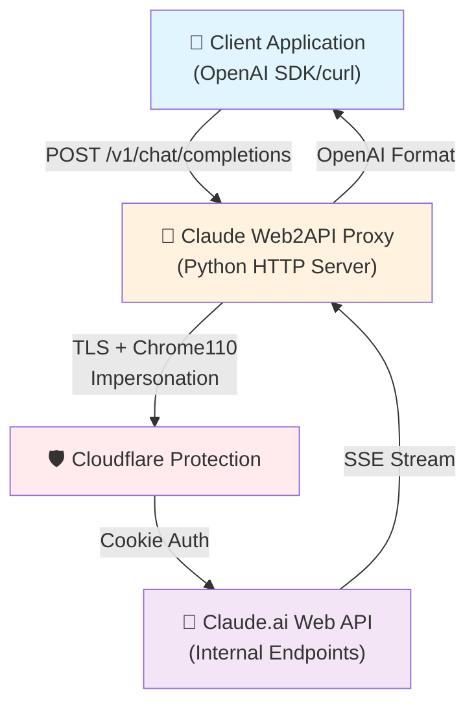
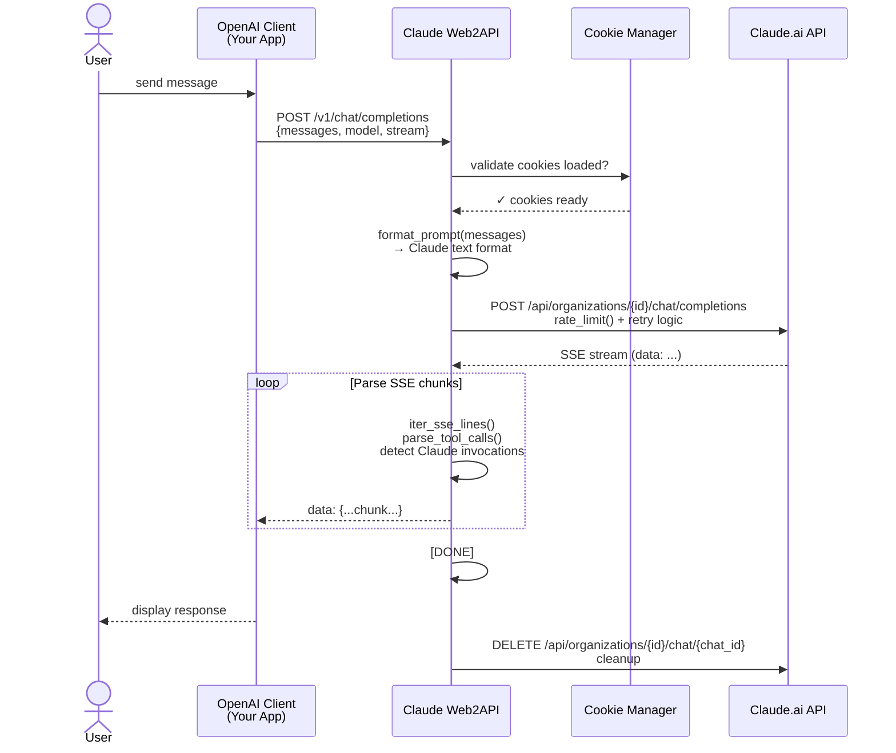
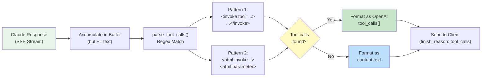
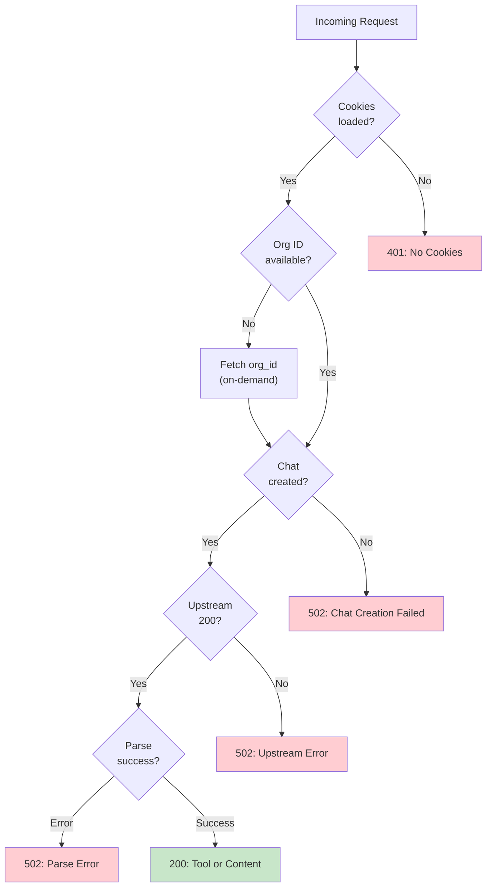
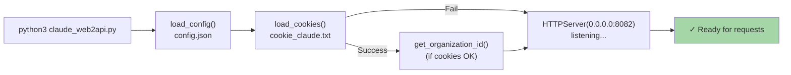

# Claude Web2API — Architecture & Flow

## System Architecture



## Request/Response Flow (Streaming)



## Tool Call Detection Flow



## Component Breakdown

| Component | Purpose | Key Features |
|-----------|---------|---------------|
| **HTTPServer** | Listen for OpenAI-format requests | ThreadingMixIn for concurrent requests |
| **Cookie Manager** | Load & validate Netscape format cookies | Parses `cookie_claude.txt` on startup |
| **Rate Limiter** | Enforce 1.5s minimum between requests | Prevents 429 Too Many Requests |
| **Retry Logic** | Exponential backoff for TLS/SSL errors | Up to 5 retries with 2^n delay |
| **SSE Parser** | Stream parsing from Claude API | Handles `completion`, `content_block_delta`, `message_stop` |
| **Tool Detector** | Regex-based tool call extraction | Supports both `<invoke>` and `<atml:invoke>` formats |
| **Response Formatter** | Convert Claude → OpenAI format | Handles streaming & blocking modes |

## Security & Authentication

```
┌─────────────────────────────────────┐
│  No API Key Required                │
│  ✓ Cookie-based auth (Claude.ai)   │
│  ✓ Chrome110 User-Agent spoofing    │
│  ✓ curl_cffi TLS fingerprinting     │
│  ✓ Cloudflare bypass support        │
└─────────────────────────────────────┘
```

## Error Handling Strategy



## Configuration & Startup



## Model Support

```
Supported Claude Models:
├── claude-3-5-sonnet-20241022 (Latest, recommended)
├── claude-3-5-haiku-20241022
├── claude-3-opus-20240229
├── claude-3-sonnet-20240229
├── claude-3-haiku-20240307
├── claude-2.1
└── claude-haiku-4-5-20251001
```

## Performance Notes

- **Concurrency**: ThreadingMixIn allows unlimited concurrent requests
- **Streaming**: Full SSE support, sent to client in real-time
- **Rate Limiting**: 1.5s enforced between requests (Claude.ai requirement)
- **Retry**: Exponential backoff handles Cloudflare TLS issues
- **Chat Cleanup**: Automatic deletion after response (no chat history leak)

---

*Generated for claude-web2api project — Architecture Documentation*
