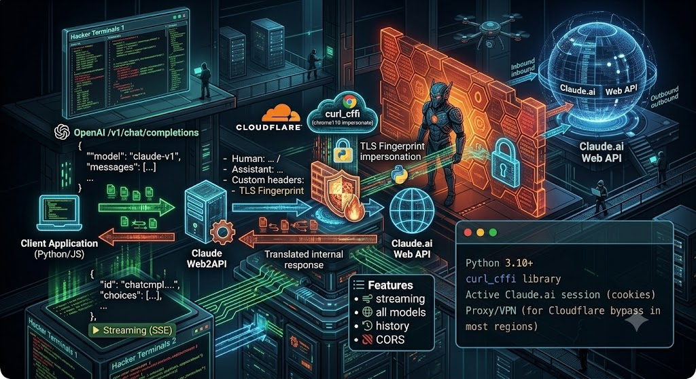

# Claude Web2API



OpenAI-compatible proxy for [Claude.ai](https://claude.ai) Web API.

Converts standard `/v1/chat/completions` requests to Claude.ai internal API. Bypasses Cloudflare via TLS fingerprint impersonation (`curl_cffi`).

## Features

- OpenAI-compatible `/v1/chat/completions` endpoint
- Streaming (SSE) and non-streaming
- All Claude models (Claude.ai selects automatically based on your account)
- Conversation history via `Human: / Assistant:` formatting
- CORS enabled

## Requirements

- **Python 3.10+**
- `pip install -r requirements.txt` (just `curl_cffi`)
- **Firefox** with [cookies.txt](https://addons.mozilla.org/en-US/firefox/addon/cookies-txt/) extension
- **Optional:** Proxy/VPN if Claude.ai is blocked in your region or returns Cloudflare errors

## Setup (step by step)

### 1. Clone & install

```bash
git clone https://github.com/YOUR_USERNAME/claude-web2api.git
cd claude-web2api
pip install -r requirements.txt
```

### 2. Copy config

```bash
cp config.json.example config.json
```

### 3. Export cookies

1. Log in to [Claude.ai](https://claude.ai/chats) in **Firefox**
2. Install [cookies.txt](https://addons.mozilla.org/en-US/firefox/addon/cookies-txt/) extension
3. Click the extension icon → **Export** → save as `cookie_claude.txt`
4. Put the file in the project directory (alongside `claude_web2api.py`)

> **Important:** The file **must** be named `cookie_claude.txt` and be in **Netscape format** (tabs between fields).

### 4. Configure proxy (if needed)

Try running without a proxy first. The `curl_cffi` impersonation handles most Cloudflare challenges on its own. Only configure a proxy if you get TLS/connection errors:

```json
{
  "proxy": "http://127.0.0.1:8080"
}
```

Common setups:
- **Hiddify / sing-box / v2ray**: `"proxy": "http://127.0.0.1:12334"`
- **SOCKS5 proxy**: `"proxy": "socks5://127.0.0.1:1080"`
- Default (no proxy): `"proxy": null` — try this first

### 5. Run

```bash
python3 claude_web2api.py
```

Expected output:
```
* Proxy server running on http://0.0.0.0:8082
* Logged in as: your@email.com
```

If you see **403 Forbidden** — your cookies expired. Re-export from Firefox.

### 6. Verify it works

```bash
# Check server is alive
curl -s http://localhost:8082/v1/models | head -c 200

# Send a message (non-streaming)
curl -s -X POST http://localhost:8082/v1/chat/completions \
  -H "Content-Type: application/json" \
  -d '{"messages":[{"role":"user","content":"Say hello in 3 words"}]}'

# Send a message (streaming)
curl -s -N -X POST http://localhost:8082/v1/chat/completions \
  -H "Content-Type: application/json" \
  -d '{"messages":[{"role":"user","content":"Count to 5"}],"stream":true}'
```

## Configuration reference

| Field | Default | Description |
|---|---|---|
| `port` | `8082` | Server port |
| `host` | `"0.0.0.0"` | Bind address |
| `proxy` | `null` | HTTP proxy for upstream (Claude.ai) |
| `model` | `"claude"` | Model name sent to OpenAI client |
| `log_requests` | `false` | Log request/response bodies |

## How it works

1. You send a standard OpenAI chat request to `/v1/chat/completions`
2. The proxy creates a new chat on Claude.ai
3. Sends your message(s) formatted as `Human: ...\n\nAssistant: ...`
4. Streams the response back (or returns it as JSON)
5. Deletes the chat from Claude.ai (no history left behind)

## Usage with OpenCode

```json
{
  "provider": {
    "claude": {
      "npm": "@ai-sdk/openai-compatible",
      "name": "Claude Local",
      "options": {
        "baseURL": "http://localhost:8082/v1",
        "apiKey": "sk-proxy",
        "timeout": 240000
      },
      "models": {
        "claude-3-5-sonnet-20241022": { "name": "Claude" }
      }
    }
  }
}
```

## FAQ

### Q: 403 Forbidden on startup
**Cookies expired.** Re-export from Firefox. Claude.ai cookies last ~1 month.

### Q: TLS / connection errors / "OpenSSL error"
Claude.ai is behind Cloudflare. If `curl_cffi` impersonation isn't enough in your region, set `"proxy"` in config.json to route through a proxy that can reach Claude.ai.

### Q: Requests hang / timeout
1. Check cookies are fresh (most common cause)
2. Increase `timeout` in your client config
3. If using a proxy, check it's running

### Q: Which model is used?
Claude.ai selects the model automatically based on your subscription. Free accounts get limited models.

### Q: How to refresh cookies?
Firefox → Claude.ai → cookies.txt extension → Export → overwrite `cookie_claude.txt` → restart proxy

### Q: Error "curl_cffi not found"
Run `pip install -r requirements.txt`. If on ARM Linux (Raspberry Pi), `curl_cffi` has no pre-built wheel — you'll need to compile from source.

## Files

```
claude-web2api/
├── claude_web2api.py      # Proxy server
├── config.json.example    # Configuration template
├── requirements.txt       # Python dependencies
├── start.sh               # Start script
├── cookie_claude.txt      # Cookies (gitignored, you create this)
├── config.json            # Active config (gitignored, from .example)
├── README.md
└── LICENSE
```

## License

MIT
